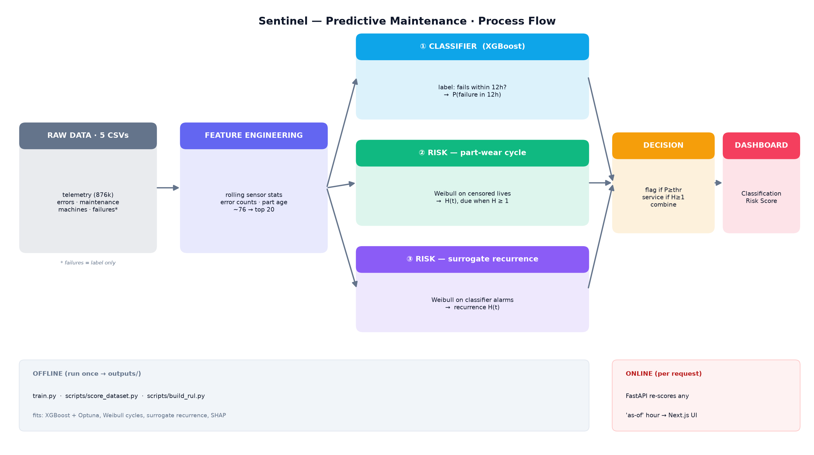
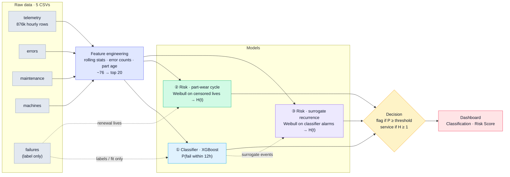
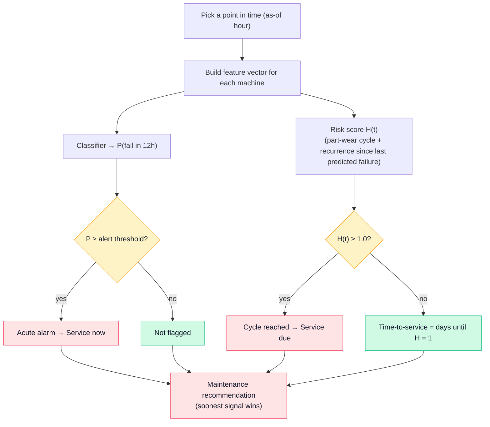
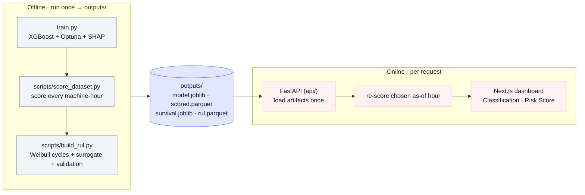
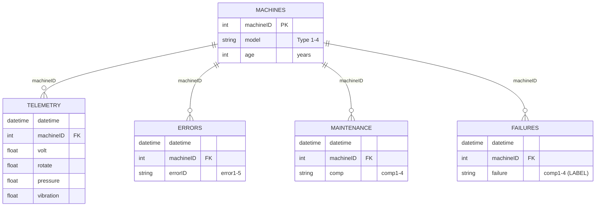

# Sentinel — Process & Architecture

Block-level representation of the predictive-maintenance system. A rendered image is at
[`docs/pipeline.png`](pipeline.png); the Mermaid sources below are editable and render on GitHub,
in VS Code (Markdown preview), and at [mermaid.live](https://mermaid.live).



---

## 1 · End-to-end pipeline



---

## 2 · Two-model decision flow (what happens at a chosen "as-of" hour)



---

## 3 · Offline build vs online serving



---

## 4 · Data model (how the tables join)



---

### How to render / export

- **GitHub / VS Code:** the ```` ```mermaid ```` blocks render automatically (VS Code needs the
  built-in Markdown preview, or the "Markdown Preview Mermaid Support" extension).
- **Live editor / PNG-SVG export:** paste a block into <https://mermaid.live> and export.
- **CLI export:** `npm i -g @mermaid-js/mermaid-cli` then `mmdc -i ARCHITECTURE.md -o out.png`.
- **Ready-made image:** [`docs/pipeline.png`](pipeline.png) (also at `outputs/reports/pipeline.png`).
