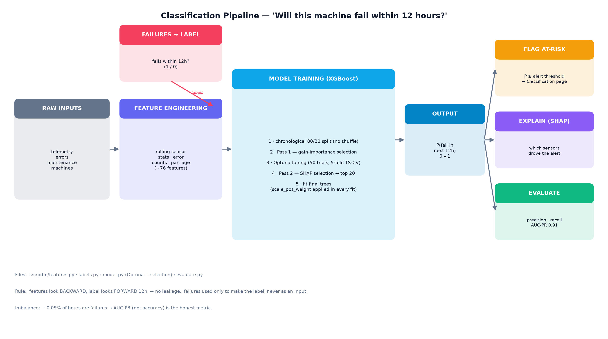
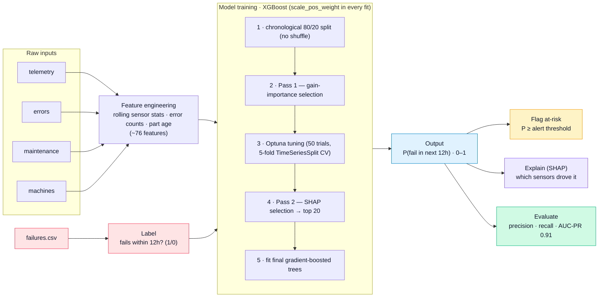
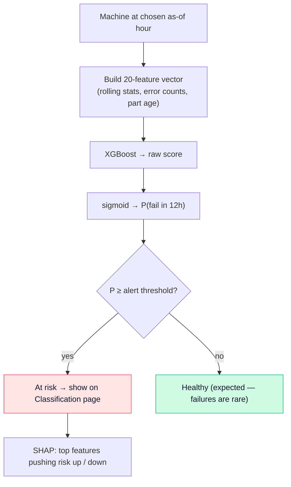

# Classification Pipeline — "Will this machine fail within 12 hours?"

Rendered image: [`docs/classification_flow.png`](classification_flow.png). Editable Mermaid below
(renders on GitHub, VS Code preview, and [mermaid.live](https://mermaid.live)).



---

## Process flow (Mermaid)



---

## The decision logic at serving time (Mermaid)



---

## Notes

- **No leakage:** every feature looks *backward* (rolling windows, time-since-replacement); the
  label looks *forward* 12 hours. `failures.csv` builds the label only — it is never a model input.
- **Imbalance:** ~0.09% of hours are failures, so a "predict healthy always" model would score
  99.9% accuracy yet be useless. The honest headline metric is **AUC-PR** (0.91), with
  **recall** (failures caught) and **precision** (alerts that are right) reported at the chosen threshold.
- **Why the probability jumps:** XGBoost outputs a raw score passed through a sigmoid — near the
  decision boundary a small change in evidence swings the probability sharply (0 → ~100%), which is
  the desired behaviour for a failure alarm (quiet, then decisive).
- **Files:** `src/pdm/features.py`, `labels.py`, `model.py` (Optuna + selection), `evaluate.py`.

### Render / export
- GitHub & VS Code render ```` ```mermaid ```` automatically.
- Paste a block into <https://mermaid.live> to export SVG/PNG.
- CLI: `npm i -g @mermaid-js/mermaid-cli` → `mmdc -i CLASSIFICATION.md -o out.png`.
