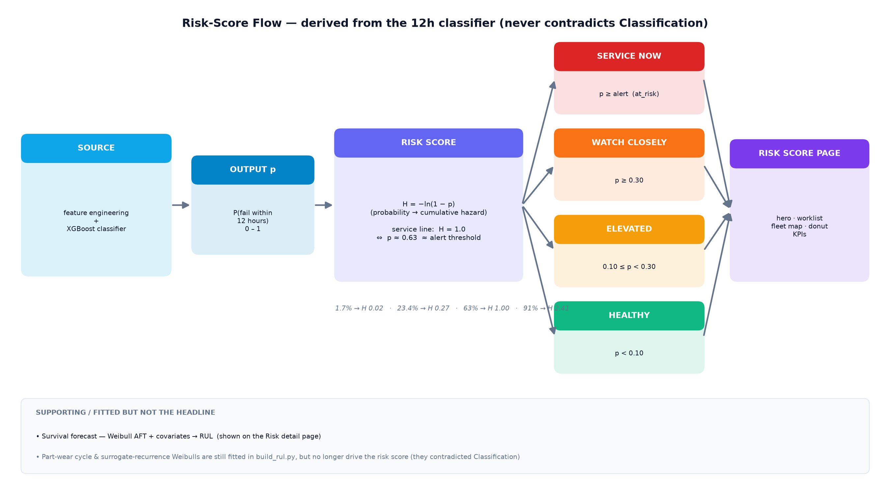
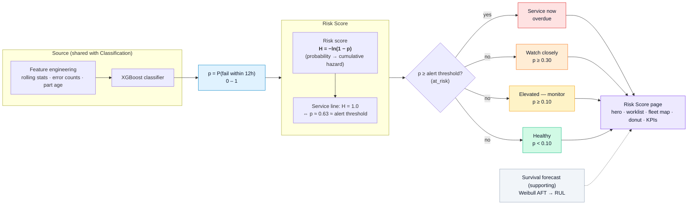
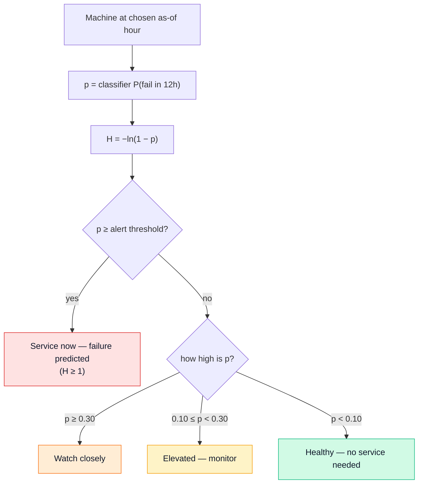
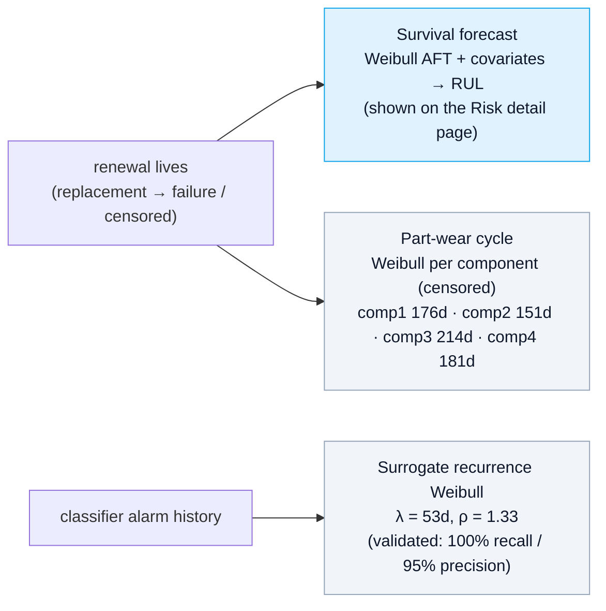

# Risk-Score Flow — "How urgent is this machine?"

Rendered image: [`docs/risk_score_flow.png`](risk_score_flow.png). Editable Mermaid below
(renders on GitHub, VS Code preview, and [mermaid.live](https://mermaid.live)).



The Risk Score is the **cumulative hazard implied by the 12-hour classifier probability**:

```
H = −ln(1 − p)          p = P(failure within 12h)
```

This is deliberate: **H = 1.0 exactly when p = 1 − e⁻¹ ≈ 0.63**, which is ~the default alert
threshold. So the Risk Score and the Classification page **can never contradict each other** —
a machine reading "23.4% · Healthy" in Classification reads "H = 0.27 · Healthy" here.

---

## Process flow (Mermaid)



---

## Decision logic at serving time (Mermaid)



---

## Mapping table (why it can't contradict)

| Classifier `p` | Risk score `H = −ln(1−p)` | Status |
|---|---|---|
| 1.7% | 0.02 | Healthy |
| 23.4% | 0.27 | Healthy |
| 50% | 0.69 | Elevated |
| **63%** | **0.99 ≈ 1.0** | **service line** |
| 91% | 2.41 | Service now |

---

## Also fitted (backend, supporting / not the headline)



> The **part-wear cycle** and **surrogate recurrence** Weibulls are still fitted by
> `scripts/build_rul.py` and served in the API, but they **no longer drive the headline Risk
> Score** — they were producing readings that contradicted Classification (e.g. "healthy 23%"
> vs "overdue 4.52"). Only the **survival forecast (AFT → RUL)** is still surfaced, as a
> clearly-labelled supporting view.

---

## Files
- `frontend/src/lib/format.ts` — `clsHazard(p)` (the risk score), `clsUrgency(item)` (the bands)
- `frontend/src/app/risk/page.tsx` — KPIs, donut, fleet map, worklist
- `frontend/src/app/risk/[machineId]/page.tsx` — detail hero + survival forecast
- `src/pdm/survival.py` — AFT / RUL (supporting)
- `src/pdm/maintenance.py`, `src/pdm/surrogate.py` — fitted, not driving the headline

### Render / export
- GitHub & VS Code render ```` ```mermaid ```` automatically.
- Paste a block into <https://mermaid.live> to export SVG/PNG.
- CLI: `npm i -g @mermaid-js/mermaid-cli` → `mmdc -i RISK_SCORE.md -o out.png`.
